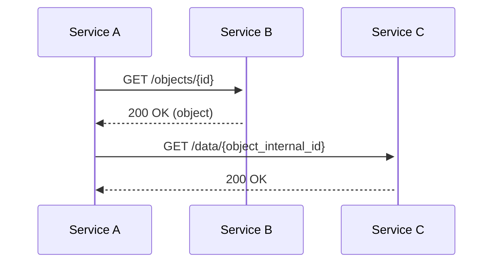

## References

- Other relevant&nbsp;

## Goals

Main KPIs of this feature

## High level design

- {{Flow chart, like this one}}

- DB changes
- UI components
- What is stored (e.g., in the state, local storage...)

## Third party integrations

- Logs
- Analytics

## Tests to be added

## Migrations

## Security implications

## Roll-out plan

<SwmMeta version="3.0.0" repo-id="Z2l0aHViJTNBJTNBTXlTZWNSZXBvJTNBJTNBbW9zaGlrc3dpbW0=" repo-name="MySecRepo">Powered by [Swimm](https://swimm-web-app.web.app/)</SwmMeta>
